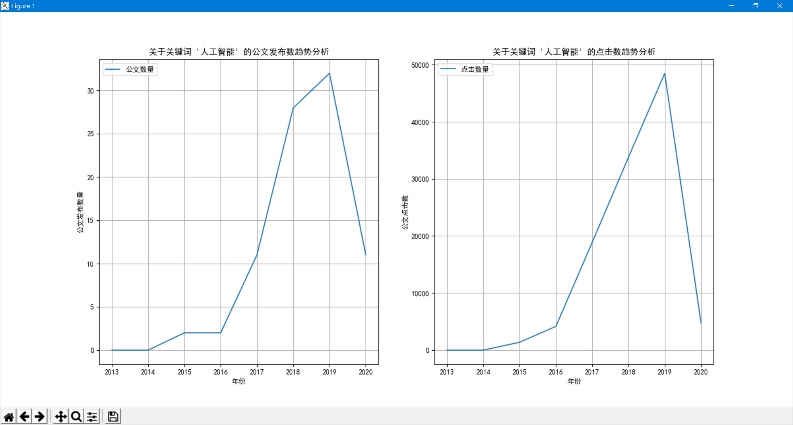
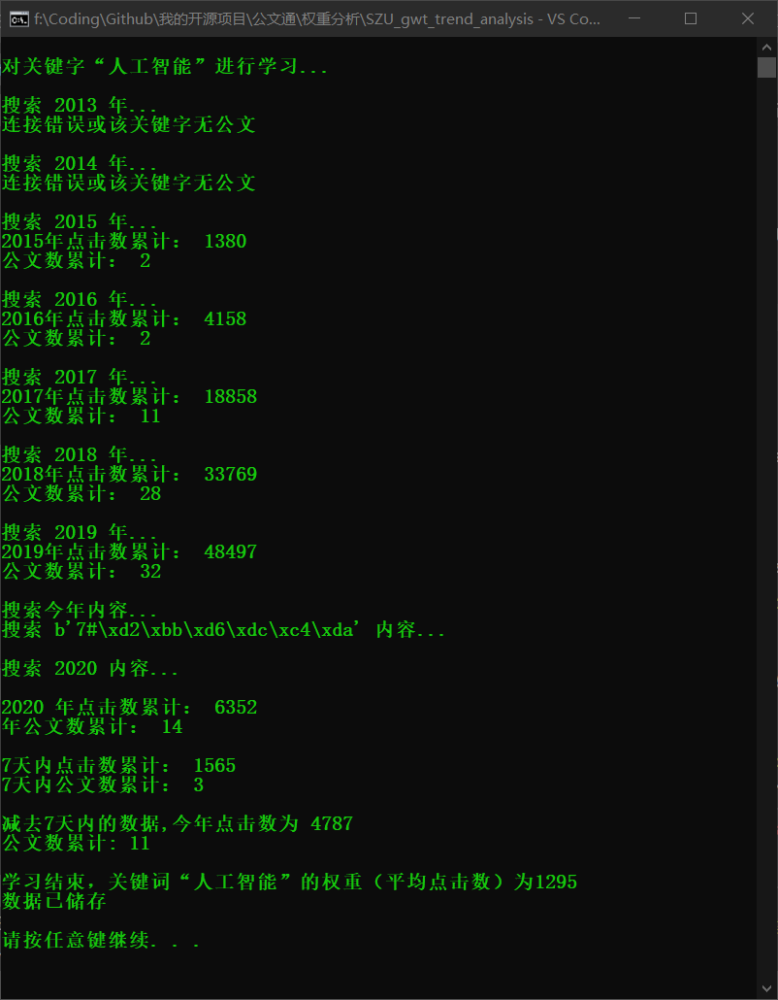

# SZU_gwt_trend_analysis
### 深大公文通-关键字逐年趋势分析

##### 从前有个微信公众号叫深大公文通

###### 它每天做的事就是把那天的公文发给大家，过程是自动化的，由爬虫爬完数据，丢给一个人工智障排序，之后再丢给selenium生成文章发文。

#### 这个过程就需要一些数据（比如某个关键词各年公文数和点击量）来让人工智障做排序。

#### 同时这些数据是可以拿来做趋势分析的。

##### 感觉关键字逐年分析的数据对一些做趋势分析或者大数据分析的同学挺有用的，所以就把这部分功能拆分出来开源了。

##### 顺便写了个画趋势图的脚本方便大家进行趋势分析，效果如图，只要输入关键字就能生成数据分析趋势图：

### 数据获取过程如图所示：

注：中间那个b'7什么的那段“乱码”的意思是，搜索七天内的内容。

## 要使用这些功能，你需要：

### pip install datetime
### pip install requests
### pip install Beautifulsoup4  
### pip install matplotlib 

### (后面两个如果安装失败需要去找网上的教程)

#### 嗯，之后就能使用了。
#### 其中数据都存储在 word_weights.json 上面，那个word_weights.json是我在服务器跑了几天累计下来的数据，基本上够用(但是那个数据由于是给人工智障用的，所以遇到很bug的数据会直接丢掉，导致2017年基本没什么正常的数据)。

#### 这里的数据分析脚本由于只是趋势分析，所以就给数据取了个模，继续用，没有直接丢掉bug数据。

#### 所以建议还是先更新一下数据再做画图分析。

#### 你如果想要更新数据，就运行 getKeywordData.py ，然后输入关键字，就能更新数据了。

#### 如果要画图的话，就运行 plot.py ，然后输入你要的关键词，就能画趋势图了（前提是word_weights.json中有这个关键词）。

# 最后求求大家康康我家小程序和公众号 ↓↓

